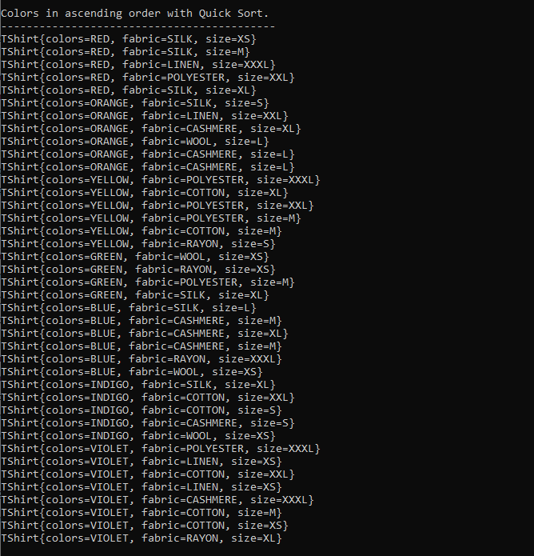
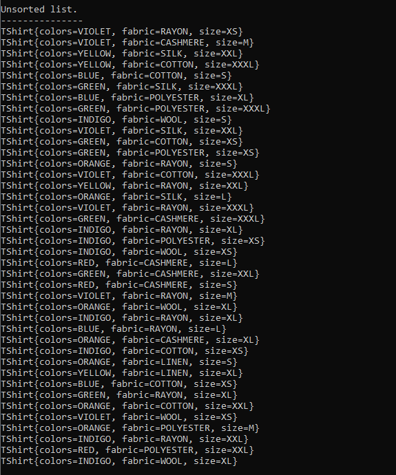
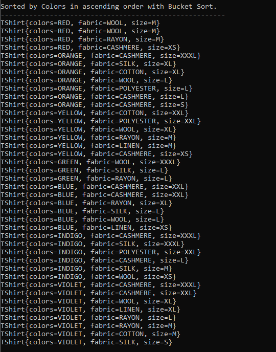

## Name

Comparative Analysis Using on Quick Sort, Bubble Sort and Bucket Sort

## Description

~ Java SE Application ~\
A Comparative Analysis of T-shirts (having Color, Fabric and Size as attributes) implementing following functionalities:\
\
&emsp;&#8226;&emsp;Create a list of random T-shirts\
\
&emsp;&#8226;&emsp;Quick Sort Algorithm\
\
&emsp;&#8226;&emsp;Bubble Sort Algorithm\
\
&emsp;&#8226;&emsp;Bucket Sort Algorithm\
\
&emsp;&#8226;&emsp;Use above algorithms to sort T-shirts' list by:\
\
&emsp;&emsp;&#8226;&emsp;Size in ascending order\
\
&emsp;&emsp;&#8226;&emsp;Size in descending order\
\
&emsp;&emsp;&#8226;&emsp;Color in ascending order\
\
&emsp;&emsp;&#8226;&emsp;Color in descending order\
\
&emsp;&emsp;&#8226;&emsp;Fabric in ascending order\
\
&emsp;&emsp;&#8226;&emsp;Fabric in descending order\
\
&emsp;&emsp;&#8226;&emsp;Size first, Color second and Fabric last in ascending order\
\
&emsp;&emsp;&#8226;&emsp;Size first, Color second and Fabric last in descending order\

### T-shirt Attibutes' Values

| Value | Size | Colors | Fabric    |
|-------|------|--------|-----------|
| 1     | XS   | RED    | WOOL      |
| 2     | S    | ORANGE | COTTON    |
| 3     | M    | YELLOW | POLYESTER |
| 4     | L    | GREEN  | RAYON     |
| 5     | XL   | BLUE   | LINEN     |
| 6     | XXL  | INDIGO | CASHMERE  |
| 7     | XXXL | VIOLET | SILK      |

## Demonstration

Executing the application all presentations are printed to user's console.

### Quick Sort
 
Unsorted T-shirts' list created for Quick Sort's presentation.

 
#### Size

##### Quick sort based on size in ascending order.

##### Quick sort based on size in descending order.

#### Colors

##### Quick sort based on colors in ascending order.

##### Quick sort based on colors in descending order.

#### Fabric

##### Quick sort based on fabric in ascending order.

##### Quick sort based on fabric in descending order.

#### Size,Colors and Fabric

##### Quick sort based on firstly size, then colors and lastly fabric in ascending order.

##### Quick sort based on firstly size, then colors and lastly fabric in descending order.

### Bubble Sort

Unsorted T-shirts' list created for Bubble Sort's presentation.

#### Size

##### Bubble sort based on size in ascending order.

##### Bubble sort based on size in descending order.

#### Colors

##### Bubble sort based on colors in ascending order.

##### Bubble sort based on colors in descending order.

#### Fabric

##### Bubble sort based on fabric in ascending order.

##### Bubble sort based on fabric in descending order.

#### Size,Colors and Fabric

##### Bubble sort based on firstly size, then colors and lastly fabric in ascending order.

##### Bubble sort based on firstly size, then colors and lastly fabric in descending order.

### Bucket Sort

Unsorted T-shirts' list created for Bucket Sort's presentation.

#### Size

##### Bucket sort based on size in ascending order.

##### Bucket sort based on size in descending order.

#### Colors

##### Bucket sort based on colors in ascending order.

##### Bucket sort based on colors in descending order.

#### Fabric

##### Bucket sort based on fabric in ascending order.

##### Bucket sort based on fabric in descending order.

#### Size,Colors and Fabric

##### Bucket sort based on firstly size, then colors and lastly fabric in ascending order.

##### Bucket sort based on firstly size, then colors and lastly fabric in descending order.

## Technology & Tools

<a href="https://www.java.com/en/download/">Java 8</a>  
<a href="https://netbeans.org/">Apache NetBeans IDE</a>  
